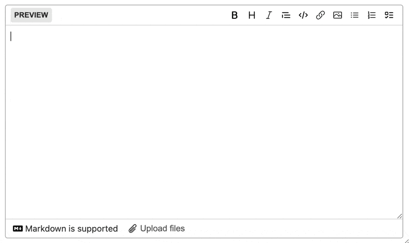

# Marksmith

Marksmith is a GitHub-style markdown editor for Rails apps.

It supports Active Storage attachments and comes with a built-in mardown preview renderer.




## Usage

```erb
<%= marksmith_tag :body %>
```

## Installation

### 1. Add `marksmith` to your `Gemfile`

Have Bundler add it by running this command:

```bash
bundle add marksmith
```

Or manually install it.

Add this line to your application's Gemfile:

```ruby
# Gemfile
gem "marksmith"
```

### 2. Install the NPM package to import the StimulusJS controller.

Install the package.

```bash
$ yarn add @avo-hq/marksmith
```

Import and register it in your application.

```js
import { MarksmithController } from '@avo-hq/marksmith'

application.register('marksmith', MarksmithController)
```

> [!NOTE]
> Marksmith comes bundled with a few dependencies by default.
> If you want to manually import those dependencies and import only the controller from the package use the `/controller` path.

```js
// Manually import Marksmith's dependencies
import '@github/markdown-toolbar-element'
import { DirectUpload } from '@rails/activestorage'
import { post } from '@rails/request.js'
import { subscribe } from '@github/paste-markdown'

// Import just the controller
import { MarksmithController } from '@avo-hq/marksmith/core'

application.register('marksmith', MarksmithController)
```

### 3. Add the style tag to your `application.html` layout

```erb
<%= stylesheet_link_tag "marksmith" %>
```

### 4. Use it

Use a form helper tag or attach it to your form builder.

```erb
<%= marksmith_tag :body, value: "### This is important" %>
or
<%= @form.marksmith :body %>
```

## Options

The field supports a few of the regular options like `disabled`, `placeholder`, `autofocus`, `style`, `class`, `rows`, `data`, and `value`, but also a custom one.

`extra_preview_params` - Sends extra params to the preview renderer.

## Built-in preview renderer

The renderer is powered by [`Redcarpet`](https://github.com/vmg/redcarpet).
It supports basic styles for headings, `strong`, `italic` and others.

In your `show.html.erb` view or the place where you want to render the compiled markup use the `marksmithed` helper and it will run the content through the renderer.

```erb
<%= marksmithed post.body %>
```

## Using with importmap

It should be as simple as running this command and have it pinned in your `importmap.rb` file.

```bash
bin/importmap pin @avo-hq/marksmith
```

## Active Storage

The editor supports [ActiveStorage](https://guides.rubyonrails.org/active_storage_overview.html) uploads using drag and drop and pasting files into the field.

Whe used in Avo it supports injecting assets using the [Media Library feature](http://docs.avohq.io/3.0/media-library.html).


## List Continuation

Marksmith has this great opt-in feature where you can have your lists continued.
We need to add the `ListContinuation` controller too.

```js
import { ListContinuationController, MarksmithController } from '@avo-hq/marksmith'
// or /core for the no-dependencies version
import { ListContinuationController, MarksmithController } from '@avo-hq/marksmith/core'

application.register('marksmith', MarksmithController)
application.register('list-continuation', ListContinuationController)
```

## Contributing

Contribution directions go here.

## License

The gem is available as open source under the terms of the [MIT License](https://opensource.org/licenses/MIT).

## Usage in Avo

Marksmith work wonderfully in Avo throught the default [markdown field](https://docs.avohq.io/3.0/fields/markdown.html).

## Other Open-Source Work

- [`active_storage-blurhash`](https://github.com/avo-hq/active_storage-blurhash) - A plug-n-play [blurhash](https://blurha.sh/) integration for images stored in ActiveStorage
- [`avo`](https://github.com/avo-hq/avo) - Build Internal Tools with Ruby on Rails
- [`class_variants`](https://github.com/avo-hq/class_variants) - Easily configure styles and apply them as classes. Very useful when you're implementing Tailwind CSS components and call them with different states.
- [`prop_initializer`](https://github.com/avo-hq/prop_initializer) - A flexible tool for defining properties on Ruby classes.
- [`stimulus-confetti`](https://github.com/avo-hq/stimulus-confetti) - The easiest way to add confetti to your StimulusJS app

## Try Avo ⭐️

If you enjoyed this gem try out [Avo](https://github.com/avo-hq/avo). It doubles your engineering speed without hiring extra developers. Teams build Internal Tools, Admin Panels, Content Management Systems, CRMs, and other types of Business Apps 10x faster on top of Ruby on Rails using Avo.

## Troubleshooting

If you ever get a 431 error from Vite, clear your brower's cache for `localhost` (chrome://settings/content/all?searchSubpage=localhost).

## Releasing

Run `bin/release x.y.z`, use `--dry` to skip publishing. This is not idempotent. If releasing fails, take note of where the process left off and continue manually.

### Details

In development we use `vite-rails` to compile and reload JS & CSS changes.

When releasing we use `rollup` to compile the StimulusJS controller and `@tailwindcss/cli` to compile the CSS.

The JS code is pushed to npmjs.org on `@avo-hq/marksmith` and the CSS file is shipped in the gem.
